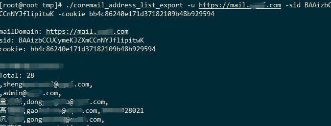
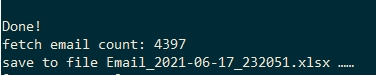
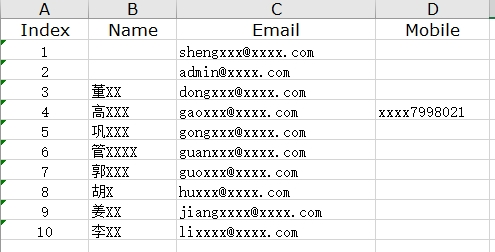

# coremail_address_list_export
export coremail address list  for coremail2020.

Usage of coremail_address_list_export:

```
  -cookie string
        Cookie.Coremail
  -h    show help
  -oT string
        out file type:txt,csv,xlsx (default "xlsx")
  -proxy string
        proxy: http://ip:port, socks5://ip:port
  -sid string
        Cookie.Coremail.sid
  -t int
        http request timeout (default 7)
  -u string
        http://mail.xxx.com
```

command line example:

```
coremail_address_list_export -u https://mail.xxxx.com -sid BAAizbxxxxx  -cookie bb4c862xxxxxxxxxxxxx
```








