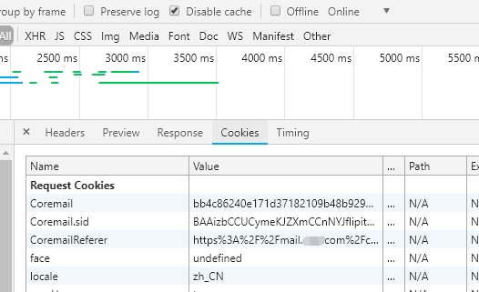

# coremail 通讯录导出
[English](README_EN.md)

此工具用于导出coremail通讯录

用法:

```
  -cookie string
        Cookie.Coremail
  -h    查看帮助选项
  -oT string
        输出文件格式,可选:txt,csv,xlsx (默认为 xlsx)
  -proxy string
        可代理格式如: http://ip:port, socks5://ip:port
  -sid string
        Cookie.Coremail.sid
  -t int
        超时时间 (默认7秒)
  -u string
        http://mail.xxx.com
```

 其中需要如下两个Cookie中的参数,使用F12 开发者工具可以找到

Cookie.Coremail、 Cookie.Coremail.sid:




命令行示例:

```
coremail_address_list_export -u https://mail.xxxx.com -sid BAAizbxxxxx  -cookie bb4c862xxxxxxxxxxxxx
```


